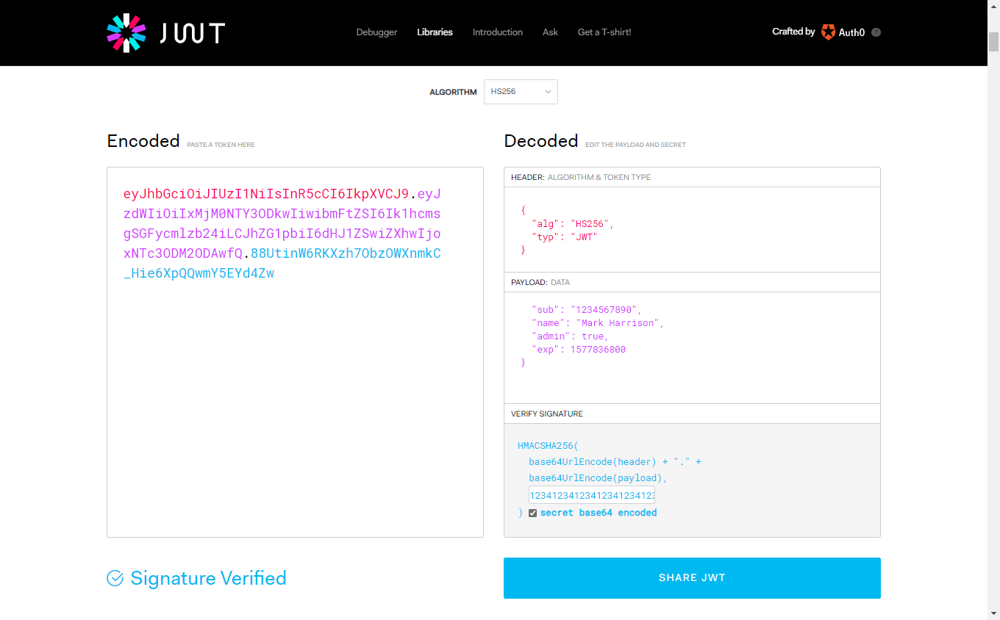
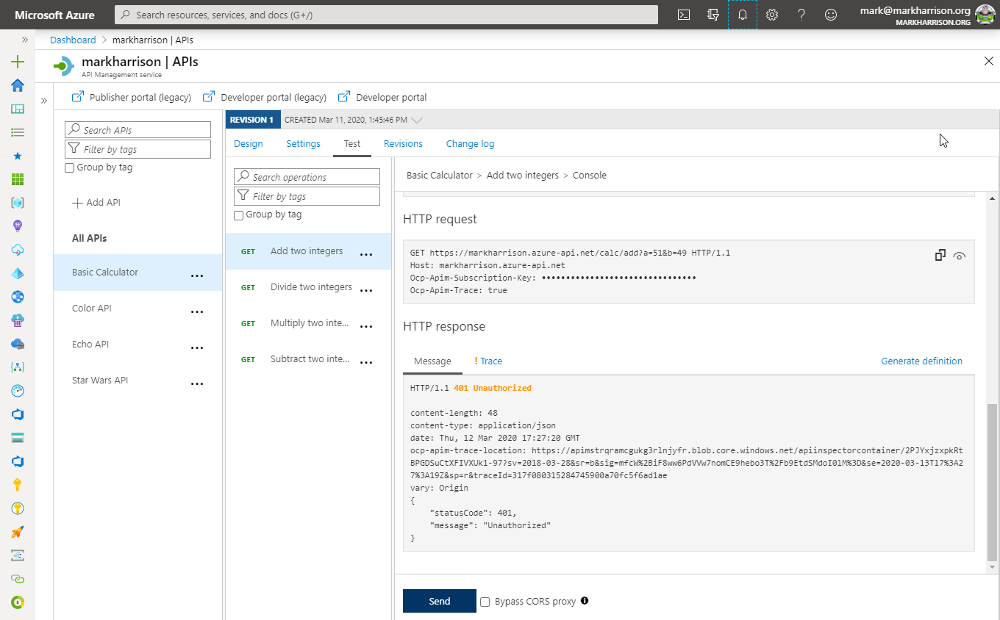
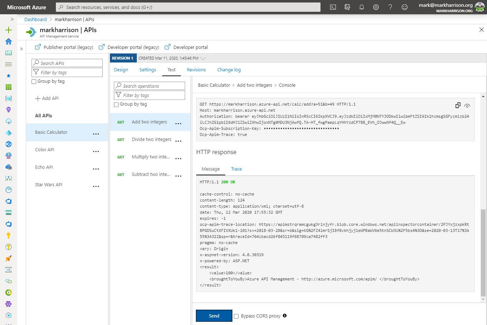
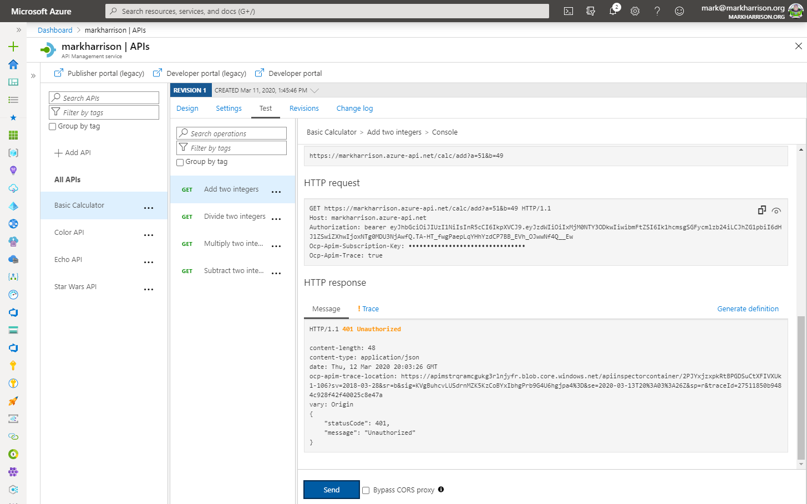
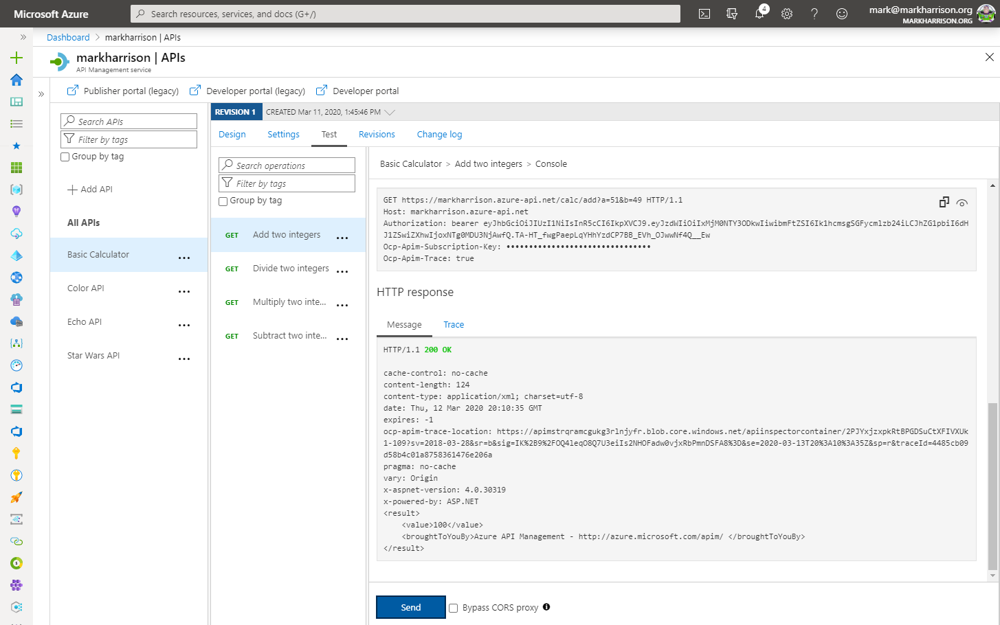
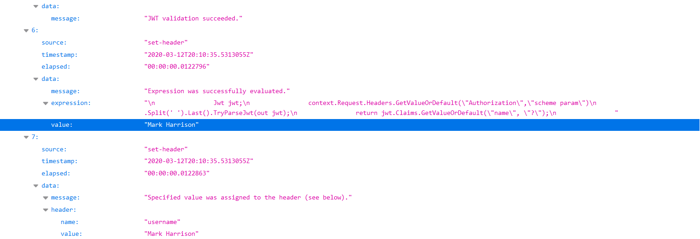

# API Management - Hands-on Lab Script - part 8


- [Part 1 - Create an API Management instance](apimanagement-1.md) 
- [Part 2 - Developer Portal and Product Management](apimanagement-2.md) 
- [Part 3 - Adding API's](apimanagement-3.md) 
- [Part 4 - Caching and Policy Expressions](apimanagement-4.md) 
- [Part 5 - Versioning and Revisions](apimanagement-5.md) 
- [Part 6 - Analytics and Monitoring](apimanagement-6.md) 
- [Part 7 - Security](apimanagement-7.md) ... this document
- [Part 8 - DevOps](apimanagement-8.md)

#### JSON Web Tokens (JWT) - validate

JSON Web Tokens are an open, industry standard method for representing claims securely between two parties. More info at <https://jwt.io/>

- Use the following sites
  - <https://jwt.io/> to create a JWT
    - Use a key that matches the value in the policy expression e.g. 123412341234123412341234
  - <https://www.unixtimestamp.com/index.php>
    - i.e. 01/01/2020  = 1577836800



- Open the Calculator API 'Code View'
- Add the inbound policy to validate that JWT is valid
  - Example shows the use of variables in an expression - useful if a value is repeated

```xml
<!-- Inbound -->
<set-variable name="signingKey" value="123412341234123412341234" />
<validate-jwt header-name="Authorization" failed-validation-httpcode="401" failed-validation-error-message="Unauthorized">
    <issuer-signing-keys>
        <key>@((string)context.Variables["signingKey"])</key>
    </issuer-signing-keys>
</validate-jwt>

```

- Invoke the API ... should get a [401 Unauthorized error]
- Invoke the API with a request header containing the security token (got above from <https://jwt.io/>) ... should get a 200 success
  - Name: Authorization
  - Value: bearer `JWT token`  (space between bearer and token)

No JWT:



Valid JWT in header:

Note the bearer token in the Request payload.
Make sure your JWT token has an expiry date in the future.



#### JSON Web Tokens (JWT) - check a claim exists

- Open the Calculator API 'Code View'
- Add the inbound policy to validate that JWT is valid and that the claim 'admin' exists
- Invoke the API - with Authorization header as above ... should get a 200 success
- Amend the policy with a claim name that doesnt exist e.g. 'adminx'
- Invoke the API - with Authorization header as above ... should get a 401 Unauthorized error

```xml
<!-- Inbound -->
        <set-variable name="signingKey" value="123412341234123412341234" />
        <validate-jwt header-name="Authorization" failed-validation-httpcode="401" failed-validation-error-message="Unauthorized">
            <issuer-signing-keys>
                <key>@((string)context.Variables["signingKey"])</key>
            </issuer-signing-keys>
            <required-claims>
                <claim name="admin" match="any">
                    <value>true</value>
                </claim>
            </required-claims>
        </validate-jwt>
```

Checking for admin claim:


Checking for adminx claim:

```xml
                <claim name="adminx" match="any">
```



#### JSON Web Tokens (JWT) - extract claim and pass to backend

- Open the Calculator API 'Code View'
- Add the inbound policy to:
  - validate the JWT (as above)
  - extract the 'name' claim and set in header (below)
- Invoke the API - with Authorization header as above ... should get a 200 success
- Use the Trace feature to inspect what was passed to backend ... should see the use name from JWT

```xml
<!-- Inbound -->
<set-header exists-action="override" name="username">
    <value>@{
        Jwt jwt;
        context.Request.Headers.GetValueOrDefault("Authorization","scheme param")
                            .Split(' ').Last().TryParseJwt(out jwt);
        return jwt.Claims.GetValueOrDefault("name", "?");
        }
    </value>
</set-header>
```





---
[Home](README.md) | [Prev](apimanagement-6.md) | [Next](apimanagement-8.md)