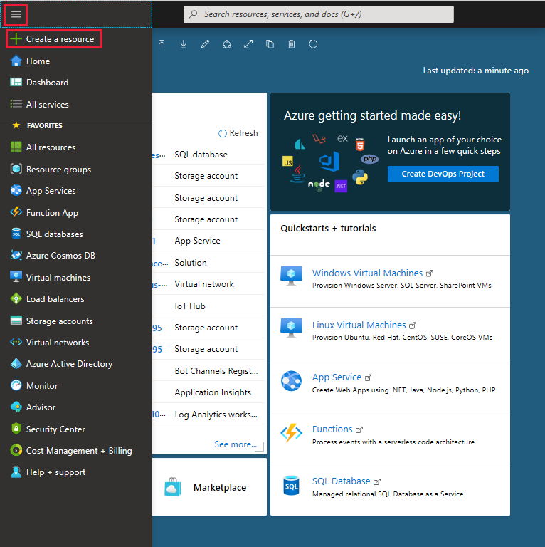
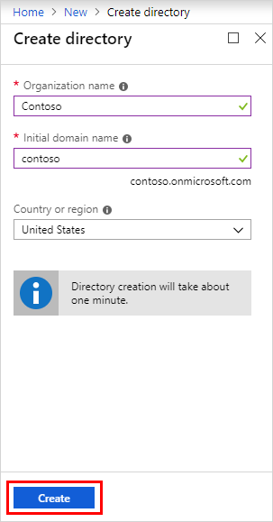

# API Management - Hands-on Lab Script

[Home](README.md)

## Additional Topics - Azure Active Directory Integration

## AAD Create a new tenant

1. Sign in to your organization's [Azure portal](https://portal.azure.com/).

1. From the Azure portal menu, select **Create a resource**.  

    

1. Select **Identity**, and then select **Azure Active Directory**.

    The **Create directory** page appears.

    

1.  On the **Create directory** page, enter the following information:
    
    - Type _Contoso_ into the **Organization name** box.

    - Type _Contoso_ into the **Initial domain name** box.

    - Leave the _United States_ option in the **Country or region** box.

1. Select **Create**.

Your new tenant is created with the domain labapimtenant.onmicrosoft.com.

## AAD Create a new users and groups

## Add a new user

You can create a new user using the Azure Active Directory portal.

To add a new user, follow these steps:

1. Sign in to the [Azure portal](https://portal.azure.com/) as a User administrator for the organization.

1. Search for and select *Azure Active Directory* from any page.

1. Select **Users**, and then select **New user**.

    

2. On the **User** page, enter information for this user:

   - **Name**. Required. The first and last name of the new user. For example, *Mary Parker*.

   - **User name**. Required. The user name of the new user. For example, `mary@contoso.com`.

     The domain part of the user name must use either the initial default domain name, *\<yourdomainname>.onmicrosoft.com*, or a custom domain name, such as *contoso.com*. For more information about how to create a custom domain name, see [Add your custom domain name using the Azure Active Directory portal](add-custom-domain.md).

   - **Groups**. Optionally, you can add the user to one or more existing groups. You can also add the user to groups at a later time. For more information about adding users to groups, see [Create a basic group and add members using Azure Active Directory](active-directory-groups-create-azure-portal.md).

   - **Directory role**: If you require Azure AD administrative permissions for the user, you can add them to an Azure AD role. You can assign the user to be a Global administrator or one or more of the limited administrator roles in Azure AD. For more information about assigning roles, see [How to assign roles to users](active-directory-users-assign-role-azure-portal.md).

   - **Job info**: You can add more information about the user here, or do it later. For more information about adding user info, see [How to add or change user profile information](active-directory-users-profile-azure-portal.md).

3. Copy the autogenerated password provided in the **Password** box. You'll need to give this password to the user to sign in for the first time.

4. Select **Create**.

The user is created and added to your Azure AD organization.

    Create user1, user2, user3
    Group blue
        Add user1
    Group green
        Add user1
        Add user2
        Add user3
    Group red
        Add user3
        

## AAD Register apps 
    Register Frontend - msal authenticate the user , obtain user group claim 
    Register api management , validate jwt 
    Register el backend legacy SOAP - certificate auth, networking firewall ///

## Modify Frontend with AAD login 
    Add a view to asp.net core frontend with msal authentication

## APIM configure OAUTH2 server
    Add oauth2 server
    Add oauth2 server to webservice
    Add jwt-validate policy 
    Transform, get user group claim and pass to legacy backend

## Legacy Backend,
    Secure using networking 

## Add legacy backend to apim

## Cofigure legacy webservice to apim

---
[Home](README.md)  
